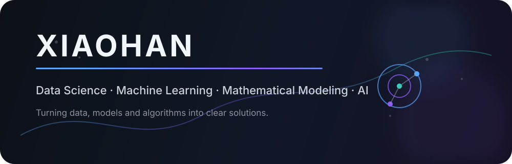

# 👋 Hi, I'm Xiaohan (韩潇)

🎓 **Data Science & Big Data Technology Student**  
📍 Yunnan University  

I am interested in exploring how **data, mathematical models and artificial intelligence** can solve real-world problems.

My current interests include:

- 🤖 Machine Learning & Artificial Intelligence
- 📊 Statistical Learning and Data Analysis
- 📐 Mathematical Modeling & Optimization
- 🔗 Probabilistic Graphical Models

---

## 🛠 Tech Stack

**Languages**

`Python` `C++` `SQL` `LaTeX`

**Data Science & AI**

`NumPy` `Pandas` `Scikit-learn` `PyTorch` `Matplotlib`

**Tools**

`Git` `GitHub` `VS Code` `Jupyter Notebook`

---

## 🚀 Featured Projects

### 📊 Machine Learning & Data Science
Exploring classical machine learning algorithms, statistical methods and data-driven solutions.

### 📐 Mathematical Modeling Portfolio
Implementing mathematical models, optimization methods and scientific computing workflows.

### 🧠 AI Learning Projects
Experiments on machine learning, deep learning and intelligent systems.

### 🎮 Game Development Exploration
- SimpleParkourGame
- MyPlatformer

---

## 📚 Currently Learning

- Machine Learning
- Statistical Inference
- Probabilistic Graphical Models
- Large Language Models
- AI-assisted Scientific Research

---

## 📈 GitHub Statistics

---

## 📫 Contact

GitHub: [@xiaohan-2005](https://github.com/xiaohan-2005)

---

*Keep learning. Keep building. Keep exploring.*

